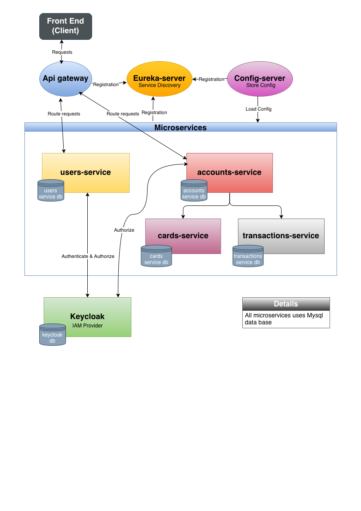

# Digital Money House

Digital Money House es una billetera virtual desarrollada en React (Frontend provisto por D.H.) y la APIRest en Java 17 usando Spring Boot 3.
Se desarrolló el backend en una arquitectura de microservicios y la seguridad se implementó con Keycloak.
Además se utilizó otras tecnologías como: Git, MySQL, Docker, Postman.

## Arquitectura del proyecto

## Funcionalidades Desarrolladas

 - Registro de usuarios (se persisten datos en las BD de Keycloak y users-service)
 - Login de usuarios
 - Autenticación por JWT token con Keycloak como proveedor IAM.
 - Recuperación de contraseña mediante enlace previamente enviado al email (Desarrollado en el back pero no integrado al frontend)
 - Obtener la información del usuario en el dashboard (saldo, avatar con su nombre y apellido, etc.)
 - Registro de actividades
 - Generación automática de alias y CVU para el usuario registrado
 - Creación de tarjetas de débito/crédito
 - Eliminación de tarjetas
 - Cargar dinero mediante tarjeta de débito/crédito
 - Cargar dinero mediante transferencia de otro usuario utilizando alias o CVU
 - Envío de dinero mediante transferencia a otro usuario utilizando alias o CVU
 - Descarga de comprobante de actividad
 - Listado de todas las actividades
 - Listado de las últimas 5 actividades
 - Ver detalle del movimiento

## Detalles de los Sprints

### Sprint I

**Historia de usuario:**  
*Como usuario, quiero registrarme en Home Banking para acceder y usar los servicios que ofrece.*

El servicio `users-service` gestiona el registro de usuarios, logueo y cierre de sesión.

**Endpoint de registro de usuarios:**  

`POST http://localhost:8084/register`

- Endpoint sin autenticación
- Datos necesarios: `firstName`, `lastName`, `email`, `phone`, `dni`, `password`
- Respuesta: Status 201 con el usuario creado
- Los campos `cvu` y `alias` se generan automaticamente y en forma aleatoria

Los usuarios se registran en Keycloak y en la base de datos de users-service (no almacenan las contraseñas en la BD de users-service).

**Historias adicionales:**

- *Como usuario, quiero acceder a HomeBanking para realizar transferencias de fondos.*

Si el login es exitoso entonces Keycloak proporciona un token para la sesion aus podemos utilizar los servicios de la app.

### Sprint II

**Historia de usuario:**  
*Como usuario, necesito ver la cantidad de dinero disponible y los últimos 5 movimientos en mi billetera Home Banking.*

**Endpoint:**  
`GET http://localhost:8084/accounts/activities`

- Requiere autenticación (Token).
- Respuesta: Últimas 5 transacciones del usuario.

**Historia de usuario:**  
*Como usuario, quiero ver mi perfil para consultar los datos de mi Cuenta Virtual Uniforme (CVU) y alias provistos por Home Banking.*

**Endpoint:**  
`GET http://localhost:8084/accounts/user-information`

- Requiere autenticación (Token).
- Respuesta: Id, balance de la cuenta, CVU y alias.

**Historia de usuario:**  
*Como usuario me gustaría ver una lista de las tarjetas de crédito y débito que tengo disponibles para utilizar.*

**Endpoint:**  
`POST http://localhost:8084/accounts/register-card`

- Requiere autenticación (Token).
- Respuesta: Confirmación de creación de la tarjeta.

**Endpoint:**  
`GET http://localhost:8084/accounts/cards`

- Requiere autenticación (Token).
- Respuesta: Lista de tarjetas disponibles.

**Historia de usuario:**  
*Como usuario, me gustaría eliminar una tarjeta de débito o crédito cuando no quiera utilizarla más.*

**Endpoint:**  
`DELETE http://localhost:8084/accounts/delete-card/${cardId}`

- Requiere autenticación (Token).
- Respuesta: Confirmación de eliminación de la tarjeta.

### Sprint III - IV

**Historia de usuario:**  
*Como usuario, quiero ver toda la actividad realizada con mi billetera, desde la más reciente a la más antigua, para tener control de mis transacciones.*

**Endpoint:**  
`GET http://localhost:8084/accounts/activities`

- Requiere autenticación (Token).
- Respuesta: Lista de historial de actividades de la cuenta.

**Historia de usuario:**  
*Como usuario, necesito el detalle de una actividad específica.*

**Endpoint:**  
`GET http://localhost:8084/accounts/activity/${activityId}`

- Requiere autenticación (Token).
- Respuesta: Detalle de la actividad por Id de la transacción.

**Historia de usuario:**  
*Como usuario, me gustaría ingresar dinero desde mi tarjeta de crédito o débito a mi billetera Home Banking.*

**Endpoint:**  
`POST http://localhost:8084/accounts/register-transaction`

- Requiere autenticación (Token).
- Datos necesarios: Tarjeta para el depósito y monto.
- Respuesta: Confirmación del depósito.

**Historia de usuario:**  
*Como usuario, quiero poder enviar/transferir dinero a un CBU/CVU/alias desde mi saldo disponible en mi billetera.*

**Endpoint:**  
`POST http://localhost:8084/accounts/register-transaction`

- Requiere autenticación (Token).
- Datos necesarios: Alias/CVU destino y monto.
- Respuesta: Confirmación de la transferencia.

## Documentación

- [Testing Manual](docs/Testing%20Manual%20con%20Postman.xlsx)
- [Request en Postman](  https://www.postman.com/flight-geoscientist-27537244/workspace/dhmoney)
